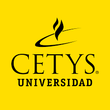

# Colorización de Imágenes con Aprendizaje Profundo

 
CETYS Universidad

Escuela de Ingeniería

Ingeniería en Ciencias Computacionales

Aprendizaje de Máquina - Dr. Ulises Orozco Rosas

Tijuana, B.C., 2 de diciembre de 2022

Este es el repositorio de nuestro proyecto de Aprendizaje de Máquina, es una red convolucional para la colorización de imágenes. Esta distribuido en 3 archivos diferentes, uno para cada tipo de imagen con los que fueron entrenados y sus respectivas pruebas. Se separó en un modelo de frutas y verduras ([Jupyter Notebook](./proy_am_natural_color.ipynb)), rostros ([Jupyter Notebook](./proy_am_faces_1.ipynb)), y paisajes ([Jupyter notebook](./proy_am_landscapes.ipynb)). También fue comparado con el modelo de **siggraph**, que se encuentra en el siguiente repostorio ([Colorful Image Colorization](https://github.com/richzhang/colorization)). 
